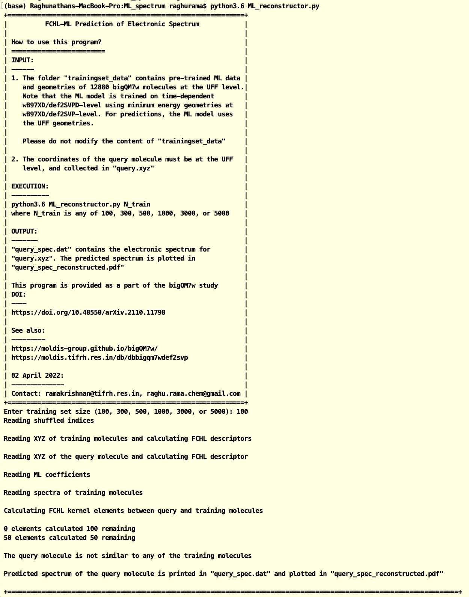

The python code `ML_reconstructor.py` predicts electronic spectrum in the 0-120 nm range for small organic molecules with CHONF atoms. The code loads 
regression weights from pre-trained FCHL-Kernel ridge regression models with trainingset sizes 100, 300, 500, 1000, 3000, and 5000. The target spectra used for training are at the TD$\omega$B97XD/def2SVPD level using minimum energy geometries from the $\omega$B97XD/def2SVP level. 

## Screenshot of sample execution

