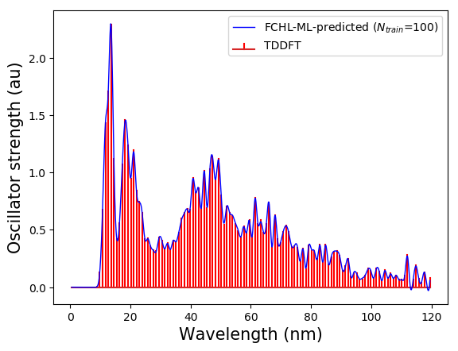
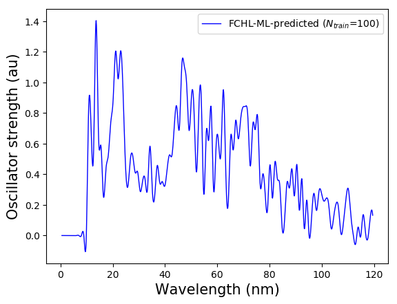
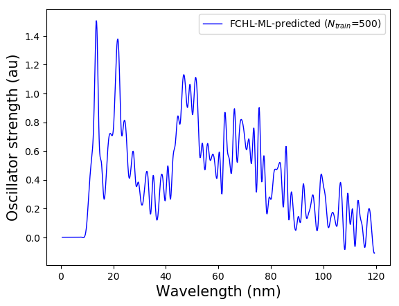
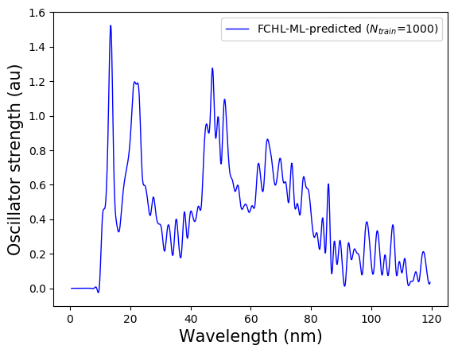
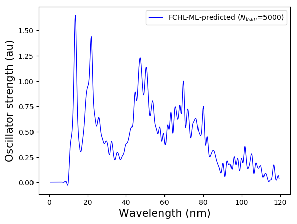
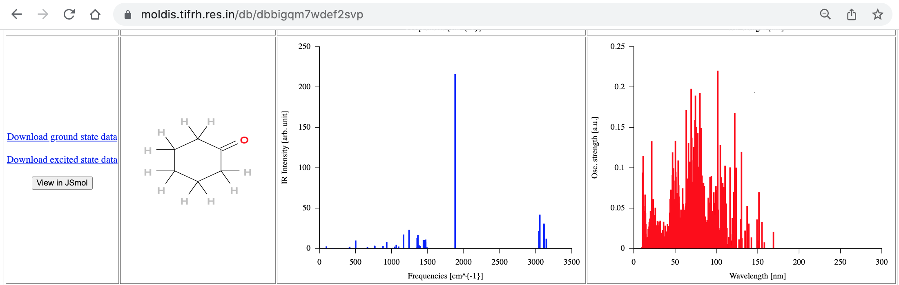

The python code `ML_reconstructor.py` predicts electronic spectrum in the 0-120 nm range for small organic molecules with CHONF atoms. The program loads 
regression weights from pre-trained machine learning models with trainingset sizes 100, 300, 500, 1000, 3000, and 5000. ML training was done using the code [QML](https://www.qmlcode.org/).

Target spectra used for training are at the TDωB97XD/def2SVPD level using minimum energy geometries from the ωB97XD/def2SVP level. 

FCHL descriptor (representation) used for training the ML models were calculated using geometries from the UFF (Universal Force Field) level. Hence, it is recommended that the structures used for querying is from the UFF level. 

## How to use the code?
You can begin by trying out the two examples provided here. `ML_spectrum/example_1` reconstructs the spectrum of a molecule _not_ in the trainingset. `ML_spectrum/example_2` reconstructs the spectrum of a molecule in the trainingset and the resulting spectrum is compared with DFT-level spectrum used for training the ML model.        

## Example 1, Reconstruction of spectrum of a molecule in the trainingset    
Let's use `geoms_bigqQM7w_UFF/005569.xyz`, which is the first molecule after shuffling the dataset as may be seen in the file `../trainingset_data/shuffle_index.dat` and use a model based on 100 training examples to reconstruct its spectrum. The content of this exercise are collected in `ML_spectrum/example_1`. We have added a few extra lines to show the DFT-level spectrum on the same plot to get the following plot.

## Example 2, Reconstruction of spectrum of a molecule _not_ in the trainingset    
Let's use Cyclohexanone `geoms_bigqQM7w_UFF/007382.xyz`, which is beyond the first 5000 molecules after shuffling the dataset as may be seen in the file `../trainingset_data/shuffle_index.dat` and use a model based on 100, 500, 1000, and 5000 training examples to reconstruct its spectrum. The content of this exercise are collected in `ML_spectrum/example_2`.

<table>
  <tr>
    <td> </td>
    <td></td>
   </tr> 
   <tr>
      <td></td>
      <td></td>
  </tr>
</table>

#### How do we check this against DFT results? 
 TDωB97XD/def2SVPD@ωB97XD/def2SVP level spectra of all 12880 molecules in the bigQM7ω dataset are collected in the [MolDis repository](http://moldis.tifrh.res.in). You can query in the corresponding dataset page [https://moldis.tifrh.res.in/db/dbbigqm7wdef2svp](https://moldis.tifrh.res.in/db/dbbigqm7wdef2svp) by choosing the stoichiometry C6H10O. 
 
If you scroll through the results, you will be able to find the entry for cyclohexanone.  

The agreement between ML predicted and DFT results should improve if the DFT results are binned with a resolution of 0.94 nm (120 nm / 128), which is the whole point of our article [Quantum Machine Learning Transition Probabilities in Electronic Excitation Spectra across Chemical Space: The Resolution-vs.-Accuracy Dilemma](https://doi.org/10.48550/arXiv.2110.11798).

## Reference
If you are using the program distributed here or any part of the bigQM7ω dataset, including its MolDis interface, please consider citing the following article.
[Ref-1] [_Quantum Machine Learning Transition Probabilities in Electronic Excitation Spectra across Chemical Space: The Resolution-vs.-Accuracy Dilemma_](https://arxiv.org/abs/2110.11798)            
Prakriti Kayastha, Sabyasachi Chakraborty, Raghunathan Ramakrishnan 
(2022)  

