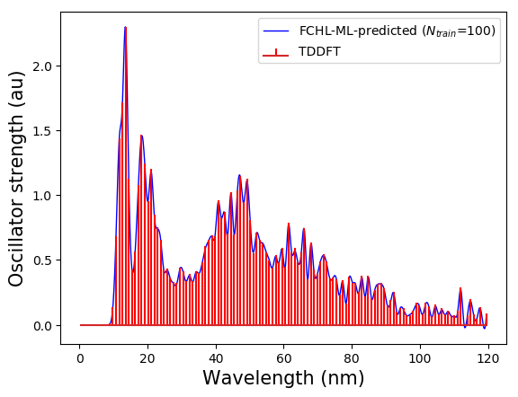

The python code `ML_reconstructor.py` predicts electronic spectrum in the 0-120 nm range for small organic molecules with CHONF atoms. The program loads 
regression weights from pre-trained machine learning models with trainingset sizes 100, 300, 500, 1000, 3000, and 5000. ML training was done using the code [QML](https://www.qmlcode.org/).

Target spectra used for training are at the TDωB97XD/def2SVPD level using minimum energy geometries from the ωB97XD/def2SVP level. 

FCHL descriptor (representation) used for training the ML models were calculated using geometries from the UFF (Universal Force Field) level. Hence, it is recommended that the structures used for querying is from the UFF level. 

## Screenshot of sample execution

## Example 1, Reconstruction of spectrum of a molecule in the trainingset    
Let's use `geoms_bigqQM7w_UFF/005569.xyz`, which is the first molecule after shuffling the dataset as may be seen in the file `../trainingset_data/shuffle_index.dat` and use a model based on 100 training examples to reconstruct its spectrum. The content of this exercise are collected in `ML_spectrum/example_2`. We have added a few extra lines to show the DFT-level spectrumon the same plot to get the following plot.

