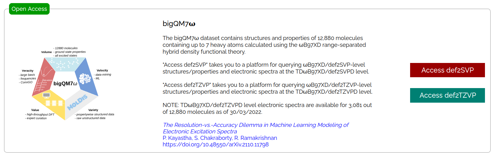

## bigQM7&omega; dataset

This dataset [Ref-1]() contains structures, ground state properties and electronic spectra calculated with the range-separated hybrid DFT method, &omega;B97XD. All results are provided for 3 basis sets: 3-21G, def2SVP, def2TZVP. Results from baseline models PM6 and ZINDO are also provided. 

Geometries at &omega;B97XD/def2SVP and &omega;B97XD/def2TZVP levels retain connectivities as encoded in the original SMILES.

***

## SMILES, Geometries and Frequencies

_3 uncharacterized molecules (indices: 7705, 7714, 7715) containing -N=N-O- substructure in a ring are eliminated._    

_NOTE: We retain molecular indices as in GDB11 so the indices run from 1 to 12883._    


#### SMILES from GDB11 universe for 12880 molecules, [SELFIES](https://github.com/aspuru-guzik-group/selfies) and UFF geometries   
[bigQM7w.smi.bz2](https://ndownloader.figshare.com/files/30478341) (52 kB)        
[bigQM7w.selfies.bz2](https://ndownloader.figshare.com/files/31084855) (32 kB)    
[bigQM7w_UFF.sdf.bz2](https://ndownloader.figshare.com/files/30478323) (1.5 MB)     
[bigQM7w_UFF.xyz.bz2](https://ndownloader.figshare.com/files/30478326) (1.4 MB)      

#### Minimum energy geometries of 12880 molecules

[bigQM7w_PM6.xyz.bz2](https://ndownloader.figshare.com/files/30478311) (2.0 MB)     
[bigQM7w_wB97XD_321G.xyz.bz2](https://ndownloader.figshare.com/files/30478314) (1.9 MB)       
[bigQM7w_wB97XD_def2SVP.xyz.bz2](https://ndownloader.figshare.com/files/30478317) (2.0 MB)      
[bigQM7w_wB97XD_def2TZVP.xyz.bz2](https://ndownloader.figshare.com/files/30478320) (2.0 MB)     

#### Harmonic frequencies of 12880 molecules

[bigQM7w_wB97XD_321G_freq.txt.bz2](https://ndownloader.figshare.com/files/30478362) (1.7 MB)       
[bigQM7w_wB97XD_def2SVP_freq.txt.bz2](https://ndownloader.figshare.com/files/30478347) (1.7 MB)      
[bigQM7w_wB97XD_def2TZVP_freq.txt.bz2](https://ndownloader.figshare.com/files/30478359) (1.7 MB)  

_NOTE: The purpose of PM6 and &omega;B97XD/3-21G geometries was to generate rapid baseline geometries for structural descriptors in ML. So, these calculations have not been performed by computing force constants only at the first step of geometry optimization, i.e., with Opt(CalcFC). Three molecules (indices: 8815, 8816, 10619) at the &omega;B97XD/def2TZVP level contain small imaginary wavenumbers with magnitude < 10cm<sup>-1</sup>_ 

Unzip the files in linux as
```
bunzip2 -f bigQM7w.smi.bz2
bunzip2 -f bigQM7w.selfies.bz2
bunzip2 -f bigQM7w_UFF.xyz.bz2
bunzip2 -f bigQM7w_UFF.sdf.bz2
bunzip2 -f bigQM7w_PM6.xyz.bz2
bunzip2 -f bigQM7w_wB97XD_321G.xyz.bz2
bunzip2 -f bigQM7w_wB97XD_def2SVP.xyz.bz2
bunzip2 -f bigQM7w_wB97XD_def2TZVP.xyz.bz2
bunzip2 -f bigQM7w_wB97XD_321G_freq.txt.bz2
bunzip2 -f bigQM7w_wB97XD_def2SVP_freq.txt.bz2
bunzip2 -f bigQM7w_wB97XD_def2TZVP_freq.txt.bz2
```

***

## Ground state properties 

#### PM6-level properties 

**Column 01** Molecule index      
**Column 02** HOMO energy (in au)               
**Column 03** LUMO energy (in au)             
**Column 04** HOMO-LUMO gap (in au)               
**Column 05** Total energy (in au)                  
**Column 06** Atomization energy (in au)      

[bigQM7w_PM6_prop.txt.bz2](https://ndownloader.figshare.com/files/30478353) (282 kB)     

#### &omega;B97XD-level properties 

**Column 01** Molecule index                 
**Column 02** Dipole moment (in debye)             
**Column 03** Polarizability (in _a_<sub>0</sub><sup>3</sup>, bohr<sup>3</sup>)              
**Column 04** HOMO energy (in _E_<sub>H</sub>, hartree)               
**Column 05** LUMO energy (in _E_<sub>H</sub>, hartree)                 
**Column 06** HOMO-LUMO gap (in _E_<sub>H</sub>, hartree)             
**Column 07** Radial expectation value, <_R_<sup>2</sup>> (in _a_<sub>0</sub><sup>2</sup>, bohr<sup>2</sup>)             
**Column 08** Zero-point vibrational energy (in kcal/mol)              
**Column 09** Sum of electronic and zero-point energies, _U_<sub>0</sub> (in _E_<sub>H</sub>, hartree)                 
**Column 10** Sum of electronic and thermal energies, _U_<sub>T</sub> at 298.15 K (in _E_<sub>H</sub>, hartree)              
**Column 11** Sum of electronic and thermal enthalpies, _H_<sub>T</sub> at 298.15 K (in _E_<sub>H</sub>, hartree)                    
**Column 12** Sum of electronic and thermal free energies, _G_<sub>T</sub> at 298.15 K (in _E_<sub>H</sub>, hartree)                
**Column 13** Total heat capacity, _C_<sub>v</sub> (in Cal/mol/K)             
**Column 14** Atomization energy (in _E_<sub>H</sub>, hartree)    
 
[bigQM7w_wB97XD_321G_prop.txt.bz2](https://ndownloader.figshare.com/files/30478350) (619 kB)           
[bigQM7w_wB97XD_def2SVP_prop.txt.bz2](https://ndownloader.figshare.com/files/30478344) (619 kB)       
[bigQM7w_wB97XD_def2TZVP_prop.txt.bz2](https://ndownloader.figshare.com/files/30478356) (617 kB)       

Unzip the files in linux as
```
bunzip2 -f bigQM7w_PM6_prop.txt.bz2            
bunzip2 -f bigQM7w_wB97XD_321G_prop.txt.bz2               
bunzip2 -f bigQM7w_wB97XD_def2SVP_prop.txt.bz2                  
bunzip2 -f bigQM7w_wB97XD_def2TZVP_prop.txt.bz2                         
```

### Mulliken charges
[bigQM7w_wB97XD_321G_Mulliken.txt.bz2](https://ndownloader.figshare.com/files/31212415)        
[bigQM7w_wB97XD_def2SVP_Mulliken.txt.bz2](https://ndownloader.figshare.com/files/31212421)           
[bigQM7w_wB97XD_def2TZVP_Mulliken.txt.bz2](https://ndownloader.figshare.com/files/31212418)     

### APT charges
[bigQM7w_wB97XD_321G_APT.txt.bz2](https://ndownloader.figshare.com/files/31212454)        
[bigQM7w_wB97XD_def2SVP_APT.txt.bz2](https://ndownloader.figshare.com/files/31212457)           
[bigQM7w_wB97XD_def2TZVP_APT.txt.bz2](https://ndownloader.figshare.com/files/31212451)    

***

## Excited state properties at ZINDO and TD-&omega;B97XD levels

**Column 01** Excitation index, _k_, with respect to ground state   
**Column 02** Excitation energy, _E_ (S<sub>0</sub>  → S<sub>k</sub>) (in eV)       
**Column 03** Excitation wavelength, _&lambda;_ (S<sub>0</sub>  → S<sub>k</sub>) (in nm)   
**Column 04** Oscillator strength of _f_ (S<sub>0</sub>  → S<sub>k</sub>) excitation  
**Column 05** _T_<sub>x</sub> (in au), x-component of transition dipole moment vector for S<sub>0</sub>  → S<sub>k</sub> excitation          
**Column 06** _T_<sub>y</sub> (in au), y-component of transition dipole moment vector for S<sub>0</sub>  → S<sub>k</sub> excitation        
**Column 07** _T_<sub>z</sub> (in au), z-component of transition dipole moment vector for S<sub>0</sub>  → S<sub>k</sub> excitation    
**Column 08** _T_<sup>2</sup> (in au<sup>2</sup>), square of transition dipole moment  for S<sub>0</sub>  → S<sub>k</sub> excitation 

[bigQM7w_ZINDO_spectra.tar.gz](https://ndownloader.figshare.com/files/30478308) (76 MB)     
[bigQM7w_TDwB97XD_321G_spectra.tar.gz](https://ndownloader.figshare.com/files/30478335) (207 MB)       
[bigQM7w_TDwB97XD_def2SVP_spectra.tar.gz](https://ndownloader.figshare.com/files/30478338) (409 MB)      
[bigQM7w_TDwB97XD_def2TZVP_spectra.tar.gz](https://ndownloader.figshare.com/files/30791935) (791 MB)      

Untar the folders in linux as

```
tar -xzf bigQM7w_ZINDO_spectra.tar.gz     
tar -xzf bigQM7w_TDwB97XD_321G_spectra.tar.gz   
tar -xzf bigQM7w_TDwB97XD_def2SVP_spectra.tar.gz   
tar -xzf bigQM7w_TDwB97XD_def2TZVP_spectra.tar.gz 
```

Each folder contains 12880 zipped files. Unzip these, for example, as follows
```
cd bigQM7w_ZINDO_spectra
bunzip2 -f bigQM7w_ZINDO_000001.dat.bz2
...
bunzip2 -f bigQM7w_ZINDO_012880.dat.bz2
```

```
cd bigQM7w_TDwB97XD_def2TZVP_spectra
bunzip2 -f bigQM7w_TDwB97XD_def2TZVP_000001.dat.bz2
...
bunzip2 -f bigQM7w_TDwB97XD_def2TZVP_012880.dat.bz2
```

***

## Data-mining platform

You can access a data-mining platform to query this dataset at [https://moldis.tifrh.res.in/datasets.html](https://moldis.tifrh.res.in/datasets.html).      


<a href="https://moldis.tifrh.res.in/datasets.html">

</a>  

***

## Raw input/output files on NOMAD

[https://dx.doi.org/10.17172/NOMAD/2021.09.30-1](https://dx.doi.org/10.17172/NOMAD/2021.09.30-1)

***

## Machine learning model for electronic spectra

To learn about the machine learning model for reconstruction of TDωB97XD/def2SVPD@ωB97XD/def2SVP-level electronic spectra, please see the material collected at [https://github.com/moldis-group/bigQM7w/tree/main/ML_spectrum](https://github.com/moldis-group/bigQM7w/tree/main/ML_spectrum)    

***

## Revision notes

_15 September 2021: First upload_                     
_27 October 2021: Mulliken and APT charges uploaded_  
_30 March 2022: Data-mining platform at MolDis announced_   
_03 April 2022: ML model for full-spectrum reconstruction made available_

***

## References
[Ref-1] [_The Resolution-vs.-Accuracy Dilemma in Machine Learning Modeling of Electronic Excitation Spectra_](hhttps://doi.org/10.48550/arXiv.2110.11798)            
Prakriti Kayastha, Sabyasachi Chakraborty, Raghunathan Ramakrishnan 
(2022)   
DOI: [https://doi.org/10.48550/arXiv.2110.11798](https://doi.org/10.48550/arXiv.2110.11798)  

***
